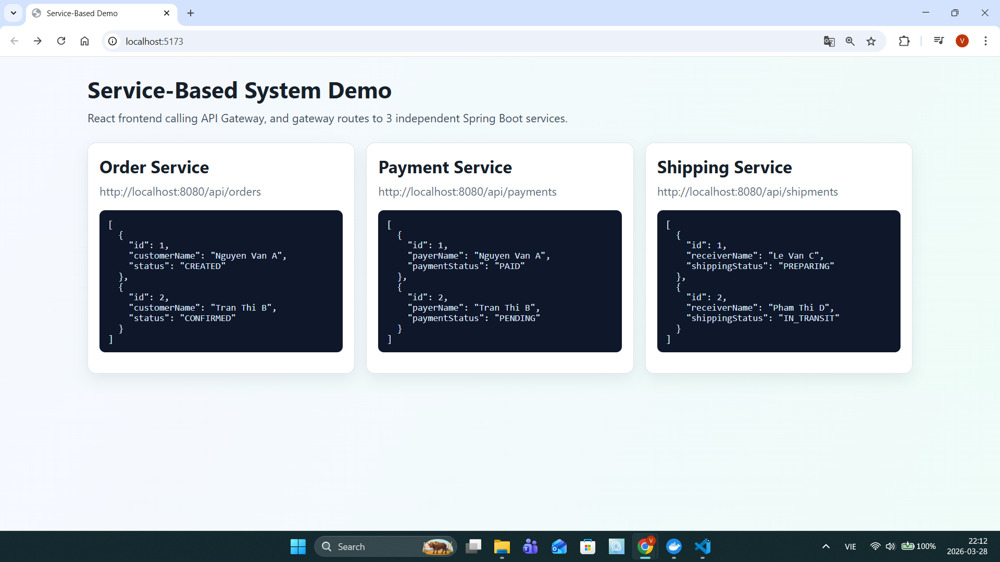

# Ảnh Minh Chứng - Tuần 05: Event-driven & Service-Based Architecture

## Tổng Quan

Tuần 05 tập trung vào hai kiến trúc chính:

1. **Event-Driven Architecture** - Xử lý sự kiện không đồng bộ
2. **Service-Based Architecture** - Chia nhỏ ứng dụng thành các service độc lập

---

## 📋 Nội Dung Bài Học

📄 **Tài Liệu Tham Khảo**: `Buổi 5_Event-driven Architecture.docx`

---

## 🏗️ Service-Based System Demo

Hệ thống này minh chứng kiến trúc **Service-Based** với 3 microservices độc lập cùng hoạt động.

### Minh Chứng Hoạt Động



_Ứng dụng chạy tại `http://localhost:5173` - Frontend gọi API Gateway, gateway định tuyến tới 3 service độc lập_

### Cấu Trúc Project

```
service-based-system/
├── docker-compose.yml         # Cấu hình chạy tất cả services
├── docker-compose.safe.yml    # Version an toàn
├── docker-compose.fast.yml    # Version tối ưu hiệu năng
├── README.md                   # Hướng dẫn project
│
├── api-gateway/               # Cổng vào duy nhất (Port 8080)
│   ├── Dockerfile
│   ├── pom.xml
│   └── src/main/java/com/example/apigateway/
│       ├── ApiGatewayApplication.java
│       └── web/GatewayController.java
│
├── order-service/             # Quản lý đơn hàng (Port 8081)
│   ├── Dockerfile
│   ├── pom.xml
│   └── src/main/java/com/example/orderservice/
│       ├── OrderServiceApplication.java
│       ├── domain/OrderRecord.java
│       ├── repo/OrderRepository.java
│       └── web/OrderController.java
│
├── payment-service/           # Xử lý thanh toán (Port 8082)
│   ├── Dockerfile
│   ├── pom.xml
│   └── src/main/java/com/example/paymentservice/
│       ├── PaymentServiceApplication.java
│       ├── domain/PaymentRecord.java
│       ├── repo/PaymentRepository.java
│       └── web/PaymentController.java
│
├── shipping-service/          # Quản lý vận chuyển (Port 8083)
│   ├── Dockerfile
│   ├── pom.xml
│   └── src/main/java/com/example/shippingservice/
│       ├── ShippingServiceApplication.java
│       ├── domain/ShipmentRecord.java
│       ├── repo/ShipmentRepository.java
│       └── web/ShippingController.java
│
└── frontend/                  # Giao diện React (Port 5173)
    ├── Dockerfile
    ├── nginx.conf
    ├── vite.config.js
    ├── package.json
    ├── index.html
    └── src/
        ├── App.jsx
        ├── main.jsx
        └── styles.css
```

### Chi Tiết Các Service

| Service              | Port | Chức Năng            | Endpoint                     |
| -------------------- | ---- | -------------------- | ---------------------------- |
| **API Gateway**      | 8080 | Định tuyến request   | `/api/*` → service tương ứng |
| **Order Service**    | 8081 | Quản lý đơn hàng     | `/api/orders`                |
| **Payment Service**  | 8082 | Xử lý thanh toán     | `/api/payments`              |
| **Shipping Service** | 8083 | Quản lý vận chuyển   | `/api/shipments`             |
| **Frontend**         | 5173 | Giao diện người dùng | React + Vite                 |
| **Database**         | 5432 | PostgreSQL           | Chi tiết schema              |

### Dữ Liệu Minh Chứng (từ screenshot)

**Order Service** (http://localhost:8080/api/orders):

```json
[
  {
    "id": 1,
    "customerName": "Nguyen Van A",
    "status": "CREATED"
  },
  {
    "id": 2,
    "customerName": "Tran Thi B",
    "status": "CONFIRMED"
  }
]
```

**Payment Service** (http://localhost:8080/api/payments):

```json
[
  {
    "id": 1,
    "payerName": "Nguyen Van A",
    "paymentStatus": "PAID"
  },
  {
    "id": 2,
    "payerName": "Tran Thi B",
    "paymentStatus": "PENDING"
  }
]
```

**Shipping Service** (http://localhost:8080/api/shipments):

```json
[
  {
    "id": 1,
    "receiverName": "Le Van C",
    "shippingStatus": "PREPARING"
  },
  {
    "id": 2,
    "receiverName": "Pham Thi D",
    "shippingStatus": "IN_TRANSIT"
  }
]
```

---

## 🐳 Cơ Sở Dữ Liệu

### Docker Image Configuration

**Thư mục**: `docker-image/`

```
docker-image/
├── docker-compose.yml         # Cấu hình PostgreSQL
└── db/
    └── init/
        ├── 01-schema.sql      # Tạo tables
        └── 02-data.sql        # Khởi tạo dữ liệu
```

###Schema Database

**Bảng: `orders`**

- id (INTEGER PRIMARY KEY)
- customerName (VARCHAR)
- status (VARCHAR)

**Bảng: `payments`**

- id (INTEGER PRIMARY KEY)
- payerName (VARCHAR)
- paymentStatus (VARCHAR)

**Bảng: `shipments`**

- id (INTEGER PRIMARY KEY)
- receiverName (VARCHAR)
- shippingStatus (VARCHAR)

---

## 🚀 Hướng Dẫn Chạy

### Bước 1: Khởi động toàn bộ hệ thống

```bash
cd service-based-system
docker-compose up -d
```

### Bước 2: Các cách chạy khác

```bash
# Version an toàn (slower nhưng safer)
docker-compose -f docker-compose.safe.yml up -d

# Version tối ưu (faster)
docker-compose -f docker-compose.fast.yml up -d
```

### Bước 3: Truy cập ứng dụng

- **Frontend**: http://localhost:5173
- **API Gateway**: http://localhost:8080
- **Order Service**: http://localhost:8081
- **Payment Service**: http://localhost:8082
- **Shipping Service**: http://localhost:8083

### Bước 4: Dừng hệ thống

```bash
docker-compose down
```

---

## 🔑 Kiến Trúc Service-Based - Lợi Ích

✅ **Độc lập**: Mỗi service có database riêng  
✅ **Linh hoạt**: Dễ scale từng service  
✅ **Bảo trì**: Lỗi trong service này không ảnh hưởng service khác  
✅ **Công nghệ linh hoạt**: Mỗi service có thể dùng công nghệ khác nhau  
✅ **Phát triển song song**: Team khác nhau có thể làm service khác nhau

---

## 📊 So Sánh Event-Driven vs Service-Based

| Khía Cạnh          | Event-Driven           | Service-Based         |
| ------------------ | ---------------------- | --------------------- |
| **Giao tiếp**      | Pub/Sub, không đồng bộ | Synchronous API calls |
| **Độc lập**        | Các listener độc lập   | Services độc lập      |
| **Độ phức tạp**    | Cao (tracking sự kiện) | Trung bình            |
| **Khả năng scale** | Cao                    | Cao                   |
| **Consistency**    | Eventual consistency   | Immediate consistency |

---

## 📂 Cấu Trúc Thư Mục Tuan05

```
Tuan05/
├── EVIDENCE.md                    # ← File minh chứng này
├── Buổi 5_Event-driven Architecture.docx
├── docker-image/                  # Database configuration
│   ├── docker-compose.yml
│   └── db/init/
│       ├── 01-schema.sql
│       └── 02-data.sql
├── minhchung/                     # Folder chứa ảnh minh chứng
│   └── service-based.png
└── service-based-system/          # Project chính
    ├── docker-compose.yml
    ├── docker-compose.safe.yml
    ├── docker-compose.fast.yml
    ├── README.md
    ├── api-gateway/
    ├── order-service/
    ├── payment-service/
    ├── shipping-service/
    └── frontend/
```

---

## ✅ Kết Luận

Tuần 05 đã thành công minh chứng:

- ✓ Kiến trúc **Service-Based** với 3 microservices hoạt động tích hợp
- ✓ **API Gateway** định tuyến request chính xác
- ✓ **Frontend React** gọi API và hiển thị dữ liệu từ 3 services
- ✓ **Database PostgreSQL** lưu trữ dữ liệu độc lập cho mỗi service
- ✓ **Docker Compose** quản lý tất cả containers

---

**Ngày tạo**: 28/03/2026  
**Tác giả**: Nguyễn Võ Hiệp (22707701)
**Mã bài tập**: KTTKPM_Tuan05
